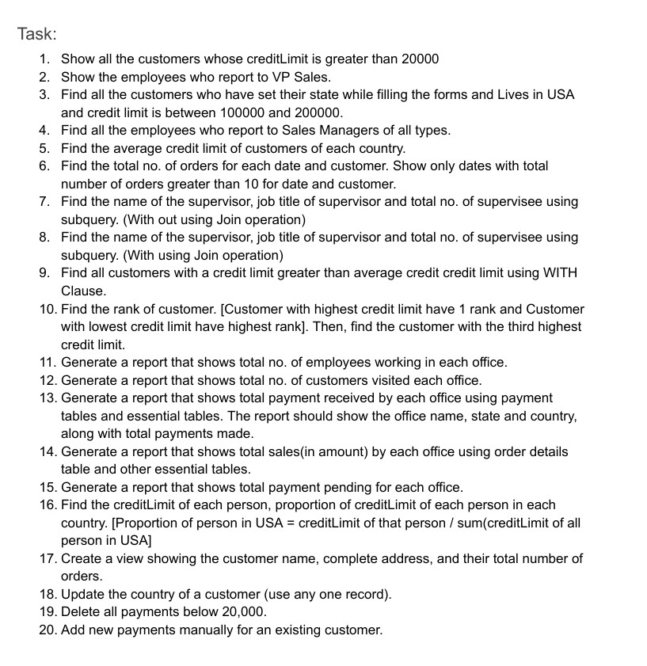

# 🗃️ Week 3: Data Wrangling with Pandas & SQL — Post-session Tasks

This repository contains the hands-on assignments completed during **Week 3** of the program, focused on mastering **data wrangling** using **Pandas** and **SQL**.

---

## 📌 Overview

In this session, we applied core data wrangling concepts using Pandas and SQL. The goal was to gain practical experience in cleaning, transforming, and analyzing real-world datasets. Both tools were used to tackle structured data tasks critical for AI/ML workflows.

---

## 📂 Contents

### 1️⃣ SQL Assignment  
Worked on **20 real-world SQL questions** using the **MySQL Classic Models database**, which simulates a retail business scenario with tables like `customers`, `orders`, `products`, `employees`, etc.

Topics covered:

- Filtering & sorting data  
- Aggregation and grouping  
- Subqueries and CTEs  
- JOINs and nested logic  
- Window functions (e.g., RANK, DENSE_RANK)  
- Data updates and conditional logic  

> 📄 Files:  
> - `Task_1-MySQL/classicmodelsolution.sql`  
> - `Task_1-MySQL/sql_assignment_submission.pdf`

#### 📸 Questions Reference  
A screenshot of the **20 SQL tasks** (`Task_1-MySQL/classic_models_questions.jpg`) is included. These questions cover realistic business scenarios such as customer behavior, employee management, product inventory, and sales analysis.

> 

---

### 2️⃣ Pandas Assignment  
Wrangled tabular data using Pandas, including:

- Loading and creating DataFrames  
- Indexing, filtering, and slicing  
- Handling missing data  
- Feature engineering and transformations  
- Aggregation and groupby operations  
- Merging and joining datasets  
- Exploratory data analysis (EDA)  
- Insights from product rating data

> 📄 File: `Task_2-Pandas/data_wrangling_with_pandas.ipynb`

> 📁 Data files:  
> - `Task_2-Pandas/data/summer-products-with-rating-and-performance_2020-08.csv`  
> - `Task_2-Pandas/data/summer-products-with-rating-and-performance_2020-08 (1).csv`

---

## 🛠️ Tools & Libraries

- `pandas`  
- `mysql-connector-python` or equivalent for SQL access  
- `jupyter notebook` / `Google Colab`

---

## 💡 Key Learnings

- SQL is essential for structured data retrieval and logic-based queries in enterprise systems  
- Pandas enables rapid, expressive manipulation of tabular data for ML pipelines  
- Combining SQL and Pandas provides flexibility and power for end-to-end data workflows

---


## 📁 Repo Structure

```

week3-post/
├── Task_1-MySQL/
│   ├── classic_models_questions.jpg
│   ├── classicmodelsolution.sql
│   └── sql_assignment_submission.pdf
├── Task_2-Pandas/
│   ├── data_wrangling_with_pandas.ipynb
│   └── data/
│       ├── summer-products-with-rating-and-performance_2020-08.csv
│       └── computed_insight_success_of_active_sellers.csv
└── README.md

```

